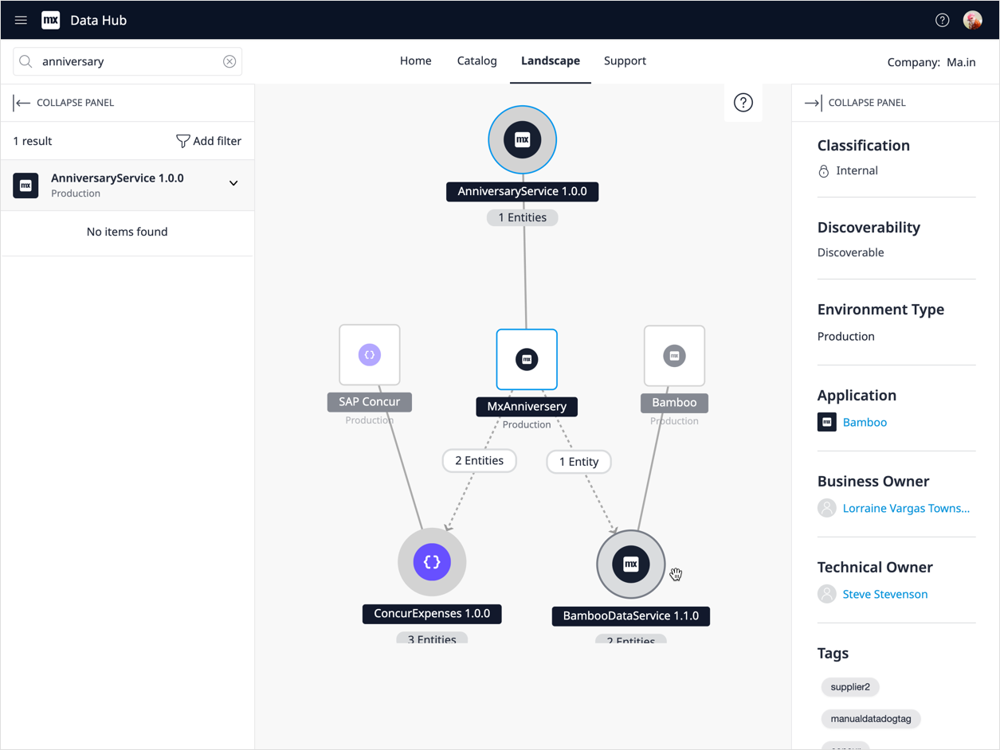
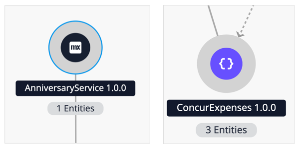
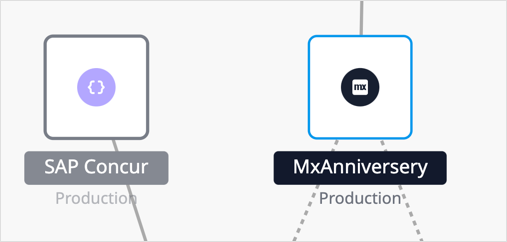
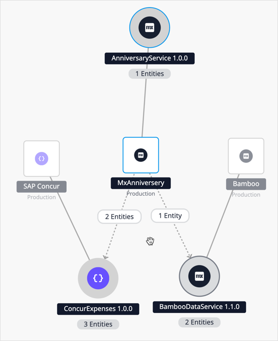

## 1 Introduction

The Data Hub Landscape presents a graphical view of the registered OData services in your Data Hub. It provides a landscape visualization of items registered in the [Data Hub Catalog](../data-hub-catalog/index) and their releationships with apps that share the datasets that are registered. In the Data Hub Landscape, the nodes are the runtime instances of applications (or, more specifically, the deployments of apps in specific environments) and the published OData services from the apps.  All public services that are issued with Data Hub are also shown in the Landscape.

In the Landscape, you will see, at a glance, the network of deployments of the apps publishing OData services and those consuming them. The Data Hub Landscape enhances the search experience of the Data Hub Catalog as follows: 

* Shows the popular apps in the Data Hub Landscape and the apps that consume data from them
* Identify the dependencies between consuming and publishing apps
* See all the services published from an app (deployed to a specific environment) and the entities that are exposed in the service
* Decide on the relevance of available entities by seeing the apps that they are consumed by
* Discover the context of the data being shared by the network of nodes for a service and the deploying app
* From the displayed network of dependencies, ascertain the differences between the services by seeing how the shared data is used

You can access the Data Hub Landscape from [Mendix Data Hub](https://hub.mendix.com/) by clicking the **Landscape** tab.

## 2 Data Hub Landscape in Detail

### 2.1 Structure and Flow of Data

A registered OData service includes the precise definition of the app and the entities—that provide the link to the shared data. The service endpoint and the deployment to a specific environment is shown as a node on the Landscape. 

The Landscape depiction of a service and its network will be such that it will show the "flow" of data  from the bottom of the display towards the top. Therefore, services that are consumed by an app will always be shown below it. Other applications that consume a selected service will always be displayed above it. A complex example of a network where this is illustrated is shown in the [example landscape network](#example-landscape) below.

### 2.2 Navigating the Landscape

By default, the Data Hub **Search** pane is on the left of the Landscape screen. When a service is selected in the search results, the selected service is displayed in the center with its network of connection. The selected service and the deploying app are highlighted with a blue outline.

When you click any of the nodes or connections, the metadata pane on the right displays the details.

To see the full details of the selected item, click the **Catalog** tab to display the **Search Details** screen in the Data Hub Catalog.

You can pan and zoom around the landscape using the mouse controls. It is also possible to "rearrange" the network of nodes by clicking a node and moving it.  The selected service will always remain centered. 

### 2.3 Nodes

Registered apps and services are depicted in the Landscape as nodes from the definitions in the registered service metadata. The icons for each of these nodes identifies the application.

#### 2.3.1 Service

Services are shown as a round node with the service name and version number and the number of entities exposed by the service.

The following examples show a selected service node from a Mendix app exposing one entity and a non-Mendix service exposing three entities:

#### 2.3.2 Apps

Apps are displayed as square icons in the landscape and the environment that the app is deployed to is given below the app name. The example below shows a non-Mendix app (**SAP Concur**) deployed to a production environment and the selected Mendix app (**MxAnniversery**):

### 2.4 Dependencies

For a service from a deployed app that is consumed by another deployed app—when the actual connection to the data for the exposed entities is made between the publishing and consuming apps—the relationships and dependencies are represented as shown and described for the example below: 

* **Solid gray line** – This links an app and the services that have been published from the app in the specified environment. In the example, the selected app **MxAnniversery** has a published service, **AnniversaryService1.0.0**. 
* **Broken gray line with an arrow (consume line)** – This indicates that an app is consuming from a service to which it is linked. The direction of the dependency is indicated by the direction of the arrow, which indicates that the consuming app makes a call to the OData service for data from the publishing app – there is an arrow to the consuming app which is "pulling" the data.  The service will get the data for the endpoint that is consumed from the publishing app.
	* The app **MxAnniversery** consumes three entities through **ConcurExpenses 1.0.0**, which is published from **SAP Concur** in production.
	* **MxAnniversery** consumes two entities through **BambooDataService 1.1.0**, which is published from the **Bamboo** app in production.

The network of dependencies that is shown will show the selected item at the center of the Landscape view. 

{}
In the case when an app publishing a service also consumes from the same service, the line for the publishing dependency will be superimposed with the line for the consuming dependency. This will result in only a single dotted-gray line being displayed. The publishing link to between the service and the app can be seen in the Metadata panel where the name of the  
{}

### 2.5 Node Details

Clicking a node will display details of the node in the **Metadata** pane. You see further details in the **Search Details** screen by clicking the **Catalog** tab. Conversely, in the **Search Details** screen, you can click the **Landscape** tab to see the network of dependencies for the selected item. 

### 2.6 Consumed Entities

If you click the **Entity** icon on the consume line, the names of the entities that are being consumed from the service will be shown in the right panel.

## 3 Example Landscape Network {#example-landscape}

This example shows a complex network of apps and services from different sources (Mendix and Team Center) that are connected. The example illustrates the "flow of data" principle of the Landscape representation for the individual service and consuming app.  However, this example also illustrates a possible exception when viewed over the whole network: The selected app (**SuperCyclingApp**) consumes from a service (**CyclingServicePublishedby…**) that is published by an app (**ConsumpingApp2**) that consumes the selected service (**CyclingService1.0.0**).

In this example, when viewed over the whole network, it appears that the data flow is from the top of the Landscape to the bottom. However, that is because of the circularity of the connections.

