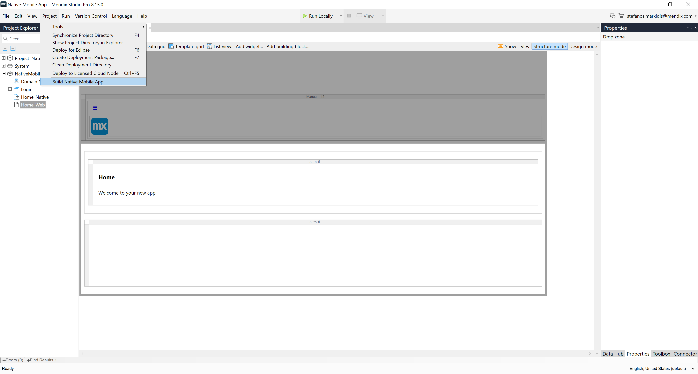
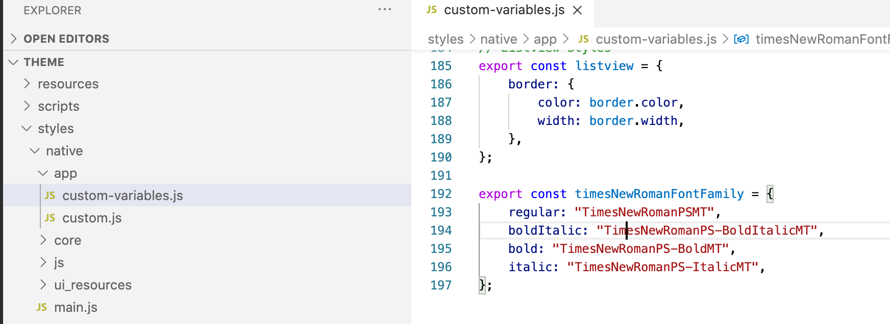
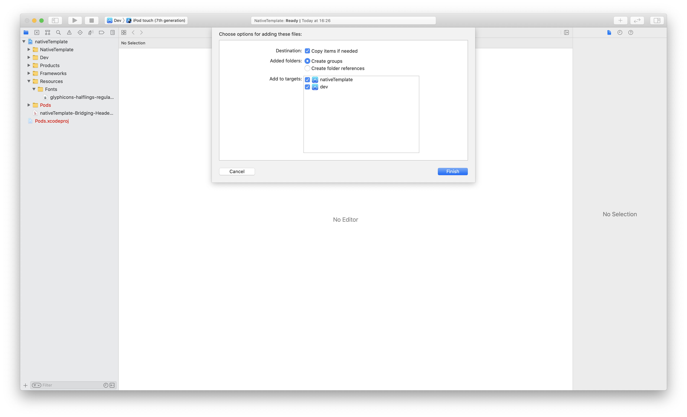
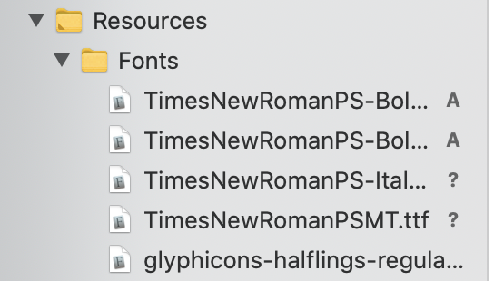

## 1 Introduction

Good typography plays a major role in conveying your app's message while reinforcing your company's brand identity. Setting up the fonts you need is as simple as dragging and dropping the required fonts and setting your app's style. As you can see in the [Prerequisites](#prerecs) section below, Mendix offers two ways for you to add custom fonts: using the Mendix Native Mobile Builder or manually.

### 1.2 Introduction to Fonts in Mendix Native Apps

When it comes to fonts files, several standards and types are common. True Type (*.ttf*), Open Type (*.otf* or *.ttf*), and Web Open Font Format (*.woff*) are the most common. 

The *.woff* file type does not work with native mobile apps. As this document focuses on native mobile platforms only, you should not use this file type in your apps.

Open Type fonts support a variety of metadata as also the possibility to package multiple font varieties in a single file. This feature is not supported for mobile platforms. You should have each variety of the Font Family you would like to add as a separate file. 

Android and iOS each take a different approach to fonts. Where Android requires an explicit declaration for each font added, iOS can derive the font type and font style dynamically. Adding fonts to each platform requires a different approach. Android expects font files to exist in a specific folder, while iOS requires the font files to be explicitly linked in its build process. 

Furthermore, both platforms resolve available fonts differently. While iOS fully supports Open Type fonts and can select fonts based on their metadata, Android requires explicit linking of the font file to the weight and style.

React Native, the underlying framework of Mendix Native Apps, unifies the process of adding fonts. For example, fonts added under **assets/fonts** on Android are explicitly linked in the project. These fonts are then exposed directly in the framework for styling your widgets using the common CSS properties you use routinely.

There are limitations to mobile font capabilities. For example, Android supports a very limited set of font types: regular, bold, italic, and bold italic.

What does that mean for your app's CSS styles? 

For example, what would happen if you were to use the following snippet in your CSS styles:

```
{ 
    fontWeight: 550
}
```

Your font, when running app on Android, would end up looking regular instead of the semi-bold font you would expect. This is because Android would first look up the available font styles registered. Unable to resolve the weight, it would fall back to the next best option. The same applies to styles.

In addition, Android expects the font filename to be a combination of the actual font family name, weight, and style. For example for Time New Roman bold italic, it expects something like *TimeNewRoman_bold_italic.ttf*. Failing to comply with these naming conventions makes the `fontFamily`, `fontWeight`, and `fontStyle` attributes fail to style text correctly.

So how can these issues be mitigated? First of all, explicitly styling text using the common CSS text attributes `fontWeight` and `fontStyle` should be avoided. The results will vary per platform. Instead, use postscript names. Specifically, instead of a single `fontFamily` attribute with multiple weights and styles, a font family needs to be defined per weight and style combination.

For example, instead of writing this: 

```
export const bold = {
    fontFamily: "Times New Roman",
    fontWeight: "bold" | "500"
}
```

Define a constant like this: 

```
export const timesNewRomanFontFamily = {
    regular: "TimesNewRomanPSMT",
    boldItalic: "TimesNewRomanPS-BoldItalicMT",
    bold: "TimesNewRomanPS-BoldMT",
    italic: "TimesNewRomanPS-ItalicMT",
};
```

Then define the styles as follows: 

```
export const boldText = { 
    fontFamily: timesNewRomanFontFamily.bold,
}
```

Now wherever you use `boldText`, you will get the expected result on both platforms consistently.

## 2 Prerequisites {#prerecs}

Before starting this how-to, make sure you have completed the following prerequisites:

Before adding fonts [using the Mendix Native Mobile Builder](#fonts-nbui):

* Run through the Native Mobile Builder's wizard at least once

Before [adding fonts manually](#manual):

* Understand the native mobile [local build process](/howto/mobile/native-build-locally)
* Locally check out your repository 
* Understand git and have a git tool installed
* Have XCode installed for the iOS sections below

## 3 Add Custom Fonts With the Mendix Native Mobile Builder {#fonts-nbui}

The Mendix Native Mobile Builder simplifies adding custom fonts to your project. It configures both Android and iOS projects and also provides the snippets needed to simply copy and paste in your Mendix project's native styles. To add custom fonts to your project, follow these steps: 

1. Start the Native Builder:

    {}{}

1. Navigate to **Custom Fonts**:

     {}{}

1. Drag and drop the font files you would like to apply. For example, Times New Roman is being used here. When the process is complete you should see the font family uploaded in the list:

     {}{}

1. Extend the list using the arrow to the right. Verify the expected fonts are available. You can continue by adding as many fonts as you prefer:

	{}

1. Click the snippet button to get the code snippet which you can copy to your styles:

	{}{}

1. Build your app to get a new binary with fonts included. 

## 4 Use Custom Fonts in Your Project

To use the new fonts to style your content, follow these instructions:

1. Copy the snippet from the Native Mobile Builder:

	{}{}

1. Open your styles *js* file and paste the snippet there. For this example, the *custom-variables.js* file is being used. For more information on styling your app, see [How to Style Your Mendix Native Mobile App](https://docs.mendix.com/howto/mobile/how-to-use-native-styling#1-introduction):

	{}{}

1. The constant can now be imported and used to define the font family of any test style. Elements styled using these classes will now be styled using the font:

	{}{}

## 5 Add Custom Fonts Manually {#manual}

While the Mendix Native Mobile Builder simplifies adding fonts, you might find yourself in a situation where you must add fonts manually instead.

### 5.1 Add Custom Fonts to an Android Project

To manually add custom fonts to your Android app, follow these instructions: 

1. Collect all the fonts you would like to use.
1. Use a tool like [Open Type Inspector](https://opentype.js.org/font-inspector.html) and derive the PostScript names for each font:

     {}{}

1. Rename the fonts to match the Postscript name. The Times New Roman font used in our example has these options: 
    * TimesNewRomanPSMT, for regular
    * TimesNewRomanPS-BoldMT, for bold

1. Copy the renamed fonts to the `android\app\src\main\assets\fonts` folder.
1. If you plan on using the tool to build your project, commit your changes:

     {}{}

1. Build your Android app using your preferred method.

Congratulations, you have learned how to add fonts to an Android project.

### 5.2 Add Custom Fonts to an iOS Project

Use XCode to manually add fonts to an iOS project:

1. Collect all the fonts you would like to use.
1.  Use a tool like [Open Type Inspector](https://opentype.js.org/font-inspector.html) and derive the PostScript names for each font:

     {}{}

1. Rename the fonts to match the Postscript name. The Times New Roman font used in our example has these options: 
    * TimesNewRomanPSMT, for regular
    * TimesNewRomanPS-BoldMT, for bold

1. Open XCode and select the workspace at **ios\NativeTemplate.xcworkspace**.
1. Drag and drop the renamed fonts to the **Resources/Fonts** folder in Project Explorer. 
1.  Select both targets from the dialog box that shows up:

     {}{}

1.  Your folder structure should look like this:

     {}{}

1. Open the *Info.plist* file by pressing <kbd>{⌘}</kbd> + <kbd>{Shift}</kbd> + <kbd>{0}</kbd>` and searching for the file. Press <kbd>{Enter}</kbd> to open it:

     {}{}

1. Find the key `Fonts provided by the application`. Expand it if needed:

     {}{}

1. Press the **+** button next to the key to create a new, empty item in the list.
1.  Type the font file name you wish to add as the value. In this case, we are adding the regular Times New Roman font, therefore the filename value is `TimesNewRomanPSMT.ttf`:

     {}{}

1. If you plan on using the tool to build your project, commit your changes:

     {}{}

1. Build your iOS app with your preferred method.

Congratulations, you have learned how to add fonts to an iOS project. 

## 6 Read More

* [Implement Native Mobile Styling](native-styling)
* [Troubleshoot Common Native Mobile Issues](common-issues)
